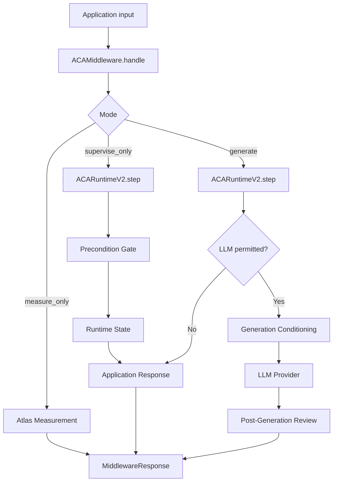

# ACA Runtime Middleware Design v0.1

## Purpose

ACA Runtime Middleware is the plug-and-play integration layer for ACA Runtime.
It wraps the existing Runtime v2 core so applications can use ACA supervision
without duplicating precondition, trajectory, generation, or review logic.

The middleware is intentionally model-agnostic. It may be used with no LLM,
with a local provider such as Ollama, or with a future provider such as OpenAI,
while preserving the same runtime supervision interface.

## Core Principle

```text
The Atlas measures.
The Runtime interprets.
The Middleware coordinates.
The Application decides.
The LLM generates only when permitted.
```

The middleware does not replace ACA Runtime. It makes ACA Runtime usable across
multiple environments: APIs, Streamlit apps, external workflows, agent systems,
and LLM providers.

## Runtime Flow



## Modes

### `measure_only`

Measures the input against ACA Atlas artifacts without mutating runtime state.

Use cases:

- dashboards;
- inspection tools;
- silent reports;
- debugging F-C-P profiles;
- non-invasive semantic analysis.

### `supervise_only`

Runs Runtime v2 precondition logic, mutates accepted state only when permitted,
and returns a deterministic application response without calling an LLM.

Use cases:

- middleware gate;
- moderation;
- n8n workflows;
- API supervision;
- enterprise policy integration;
- Streamlit visual demo.

### `generate`

Runs Runtime v2 first, calls an LLM provider only when permitted, and reviews the
generated output before release.

Use cases:

- supervised assistant;
- Ollama demo;
- future OpenAI provider;
- controlled chat;
- agent generation wrapper.

If `generate` is requested without an LLM provider, the middleware falls back to
supervision-only behavior and reports `provider_not_configured` in metadata.

## Public Interface

```python
from aca_runtime.middleware import ACAMiddleware

middleware = ACAMiddleware(
    artifacts_root="path/to/ACA/artifacts",
    mode="supervise_only",
)

result = middleware.handle(
    text="Evaluate whether the evidence supports the claim.",
    objective="Analyze claims using only available evidence.",
)

print(result.to_dict())
```

## Response Object

The middleware returns a `MiddlewareResponse` with:

- `mode`;
- `input_text`;
- `objective`;
- `admitted`;
- `action`;
- `final_response`;
- `llm_called`;
- `should_call_llm`;
- `boundary_applied`;
- `runtime_result`;
- `measurements`;
- `application_response`;
- `llm_response`;
- `post_generation_review`;
- `metadata`.

This object is application-neutral. Different applications can decide how much of
it to display or act upon.

## Design Constraint

The middleware must preserve the Runtime v2 invariant:

```text
A non-admitted input must never alter semantic origin
or accepted trajectory.
```

Therefore, `measure_only` never mutates state, and `supervise_only` / `generate`
only mutate RuntimeState through `ACARuntimeV2.step()`.

## Relationship to Existing Components

The middleware reuses existing runtime modules:

```text
aca_runtime/runtime/runtime_v2.py
aca_runtime/runtime/precondition_gate.py
aca_runtime/runtime/runtime_state.py
aca_runtime/runtime/application_response.py
aca_runtime/runtime/generation_conditioning.py
aca_runtime/runtime/supervised_generation.py
aca_runtime/runtime/post_generation_review.py
aca_runtime/runtime/llm_providers/
```

It does not duplicate their logic.

## Next Steps

1. Add middleware quickstart examples.
2. Add API endpoint for middleware mode.
3. Build Streamlit demo on top of `ACAMiddleware`.
4. Add Ollama provider demo as optional generation mode.
5. Add trace logging for future Criterion Trace Learning.
